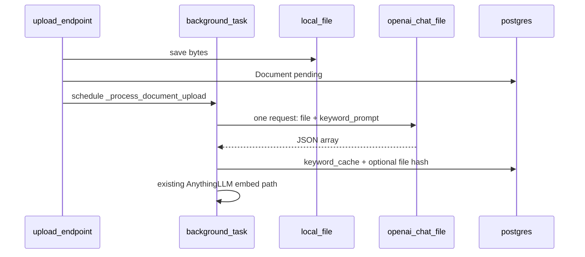

# 以原始上傳檔做一次性 keywords 抽取（Chat + File，唔用 RAG）

## 現況（你要改嘅部分）

- `[backend/document_keywords.py](backend/document_keywords.py)`：heuristic + LLM，但 LLM 只睇 `**converted_markdown` 頭 12k 字**（`LLM_INPUT_MAX_CHARS`），同你講嘅「全文語境」唔一致。
- `[backend/routers/chapters.py](backend/routers/chapters.py)` 嘅 `_process_document_upload`：AnythingLLM 上傳／embed；`converted_markdown` 來自 `pageContent`；**冇**喺上傳流程預先寫 keywords。
- Keywords API：`[get_chapter_document_keywords](backend/routers/chapters.py)` / `refresh` 而家係 lazy／refresh 時先跑 `get_or_compute_keyword_items`。
- Lesson plan 生成 `[_build_rag_context](backend/routers/lesson_plans.py)` 用 DB 文字 + vector snippet：**呢條係教案內容**，同「keywords 候選」係兩條 pipeline；本次範圍係 **keywords 管道**，除非你之後再要求改教案 primary text。

## 目標行為

1. **來源**：用磁碟上已保存嘅檔案（背景任務已有 `file_bytes`，同 `[Document.original_file_path](backend/models/document.py)` 一致），經 **OpenAI Chat Completions + File input**（官方支援 PDF／Office 等；見 [File inputs / PDF](https://platform.openai.com/docs/guides/pdf-files)）送 **單次** user 請求，請模型輸出 **JSON 字串陣列**（與而家 UI「章節／小標題」語意一致）。
2. **時機**：喺 `_process_document_upload` 入面，**盡早**（建議 AnythingLLM 之前或並行唔阻塞你現有 embed 邏輯）完成抽取並 `commit` 入 `doc.keyword_cache`，等前端第一次開 materials scope 多數已經有 cache。
3. **可靠度**：cache key 改用 `**file_bytes` SHA256**（或上傳時寫入一個 `file_content_sha256` 欄位），唔再依賴 `hash_converted_text(converted_markdown)` 做 keywords 嘅唯一依據。
4. **唔用 RAG**：唔用 vector search、唔用 chunk retrieval；必要時只係 **HTTP 層面**一次請求帶 file（若將來單檔超 API 上限，先至要談第二階段，而家唔做）。

## 已有程式可重用（你記得嗰段）

`[backend/routers/courses.py](backend/routers/courses.py)` 已有 `**_call_llm_with_file`**（約 260–298 行）：將 `file_bytes` **base64** 後用 `user_content` 入面 `type: "file"`、`file_data: "data:{content_type};base64,..."`，再加一段 text prompt，直接 `chat.completions.create`——註解寫明 *「no chunking or summarisation」*，同你想做嘅 keywords **同一種送檔方式**。而家用於 `**_generate_syllabus_bg`** 產 syllabus。

**實作時建議**：將呢個 helper **提升到** `[backend/openai_client/__init__.py](backend/openai_client/__init__.py)`（或 `openai_client/file_chat.py`），畀 `courses.py` 同 `document_keywords` / `chapters.py` 共用；keywords 只需要換 **system／user prompt** 同 parse JSON array，唔使再發明 base64 管道。

## 建議流程（高層）

## Prompt 設計要點（可直接落地做常量）

- **System**：要求只回 **合法 JSON 陣列**（字串），唔好 markdown／解釋。
- **User**：簡述任務與而家 UI 一致：列出**結構性標題**（章、節、極短小標），**排除**長句、問答行、步驟列、頁碼；上限例如 30 條（沿用 `MAX_HEADING_ITEMS`）；語言跟文件（中英混雜可接受）。
- **輸出後處理**：沿用現有 `filter_heading_candidates` / `dedupe_preserve_order` 做後門防呆（防止模型略為越界）。

## 程式改動（精簡清單）

| 區域                                                                                                                                   | 改動                                                                                                                                                                                                                                                                               |
| ------------------------------------------------------------------------------------------------------------------------------------ | -------------------------------------------------------------------------------------------------------------------------------------------------------------------------------------------------------------------------------------------------------------------------------- |
| `[backend/openai_client/__init__.py](backend/openai_client/__init__.py)`（或新細 module）                                                 | **抽出**現有 `courses._call_llm_with_file` → 例如 `chat_complete_with_file(...)`（base64 inline file 已驗證可用），`courses` 改 import；keywords 流程直接呼叫並傳 keyword prompt。                                                                                                                        |
| `[backend/document_keywords.py](backend/document_keywords.py)`                                                                       | 新增 `extract_keyword_items_from_file_bytes(...)`；調整 `get_or_compute_keyword_items`：優先檢查 **file hash** 與 cache；refresh 清 cache 後走檔案路徑。舊嘅 heuristic+markdown LLM 可保留為 **fallback**（僅當 OpenAI file 失敗且已有 `converted_markdown`），避免 UI 完全冇候選——若你堅持 **fail 就唔顯示** 而唔要 fallback，實作時可刪呢支。 |
| `[backend/routers/chapters.py](backend/routers/chapters.py)`                                                                         | 喺 `_process_document_upload` 適當位置 await 新抽取函數並寫 DB；確保失敗時 log，唔一定令整個 upload 變 failed（embed 仍可成功），除非你希望 `conversion_status` 反映 keywords——多數建議 **獨立欄位或只 log**。                                                                                                                      |
| `[backend/models/document.py](backend/models/document.py)` + migration / `[backend/main.py](backend/main.py)` 既有 ALTER 模式            | 可選：加 `keyword_extracted_at` 或 `file_sha256` 欄位；若唔加欄位，亦可每次用 `Path(doc.original_file_path)` 讀檔再 hash（較慢但改動少）。                                                                                                                                                                      |
| `[frontend/components/lesson-plan/lesson-plan-materials-scope.tsx](frontend/components/lesson-plan/lesson-plan-materials-scope.tsx)` | 微調文案：說明候選來自「上傳檔直接分析」；`staleTime` 可略縮短或 upload 成功後 invalidate `chapter-doc-keywords`（若 upload response 會觸發 refetch）。                                                                                                                                                              |

## 風險與前提（要你自己接受嘅 trade-off）

- **API 限制**：OpenAI 對單檔大小／頁數有上限；超上限要另外設計（你今次已揀「原始檔單次」；超出時可能要分案處理或改模型）。
- **成本／延遲**：每個上傳多一次 multimodal／file 請求。
- **TXT/MD**：同樣可以走 file input；極細嘅 `.txt` 亦可選擇純文字塞入 message 慳錢（可選優化）。

## 驗證建議

- 上傳一個 PDF → DB `keyword_cache` 有 `items`，GET `/keywords` 唔再觸發長計算。
- Refresh：清空後用同一檔再抽，結果合理。
- OpenAI 失敗時：確認 fallback 行為符合你選擇（有／無）。

